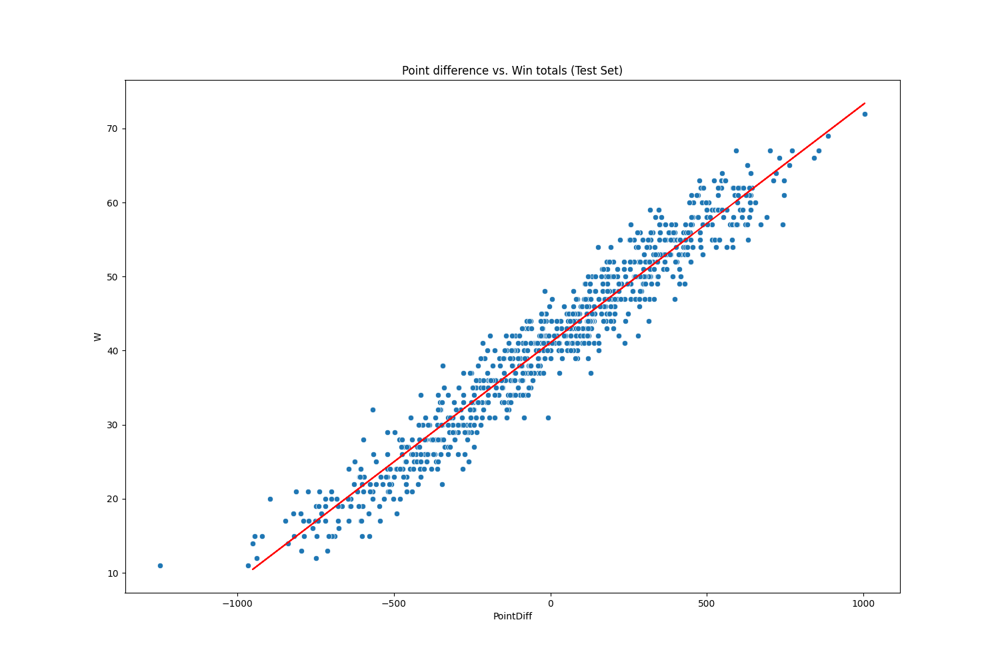
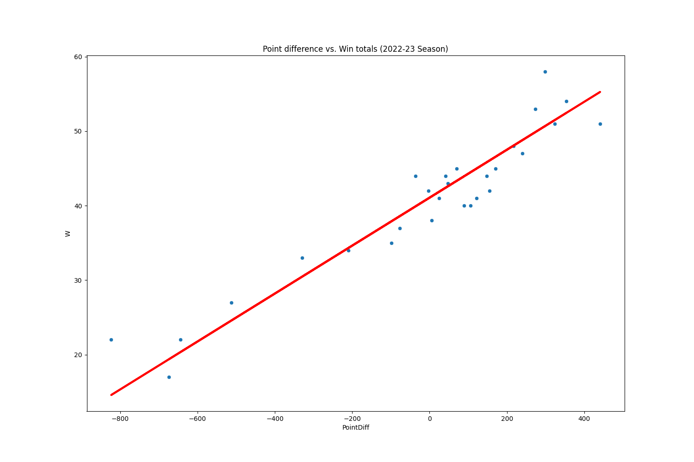

# NBA Win Prediction with Linear Regression

## Introduction

The objective of this project is to develop a linear regression model capable of predicting the number of wins for NBA teams based on their point differentials. The model will be trained using data from the 1980-2011 NBA seasons and validated with data from the 2022-2023 NBA season.

# Dataset
The project utilizes two datasets:

- NBA_train.csv: Training data from the 1980-2011 NBA seasons.
- NBA_test.csv: Test data from the 2022-2023 NBA season.

## Installation

To run the code successfully, install the necessary packages by running:

```bash
pip install -r requirements.txt
```

## Solution

### 1. Importing the Required Packages

```python
import numpy as np
import pandas as pd
import matplotlib.pyplot as plt
import seaborn as sns
from sklearn.linear_model import LinearRegression
from sklearn.model_selection import train_test_split, cross_val_score
from sklearn import metrics
```

### 2. Loading and Exploring the Dataset

We import the training and test data from the CSV files, and then offer a comprehensive dataset overview. This includes presenting the initial 5 rows, data information, and summary statistics.

```python
# Load the training and test data
try:
    data_train = pd.read_csv('NBA_train.csv')
    data_test = pd.read_csv('NBA_test.csv')
except FileNotFoundError:
    print("Error: Data files not found.")
    exit(1)

# Display basic information about the dataset
print("First 5 rows of the training dataset:")
print(data_train.head())

print("\nInformation about the training dataset:")
print(data_train.info())

print("\nSummary statistics of the training dataset:")
print(data_train.describe())
```
This approach not only loads the data but also emphasizes a thorough exploration, providing a holistic understanding of the dataset's characteristics, essential for subsequent analysis and model development.

The output of the above code is shown below:

```text
First 5 rows of the training dataset:
   SeasonEnd                 Team  Playoffs   W  ...   AST  STL  BLK   TOV
0       1980        Atlanta Hawks         1  50  ...  1913  782  539  1495
1       1980       Boston Celtics         1  61  ...  2198  809  308  1539
2       1980        Chicago Bulls         0  30  ...  2152  704  392  1684
3       1980  Cleveland Cavaliers         0  37  ...  2108  764  342  1370
4       1980       Denver Nuggets         0  30  ...  2079  746  404  1533

[5 rows x 20 columns]

Information about the training dataset:
<class 'pandas.core.frame.DataFrame'>
RangeIndex: 835 entries, 0 to 834
Data columns (total 20 columns):
 #   Column     Non-Null Count  Dtype 
---  ------     --------------  ----- 
 0   SeasonEnd  835 non-null    int64 
 1   Team       835 non-null    object
 2   Playoffs   835 non-null    int64 
 3   W          835 non-null    int64 
 4   PTS        835 non-null    int64 
 5   oppPTS     835 non-null    int64 
 6   FG         835 non-null    int64 
 7   FGA        835 non-null    int64 
 8   2P         835 non-null    int64 
 9   2PA        835 non-null    int64 
 10  3P         835 non-null    int64 
 11  3PA        835 non-null    int64 
 12  FT         835 non-null    int64 
 13  FTA        835 non-null    int64 
 14  ORB        835 non-null    int64 
 15  DRB        835 non-null    int64 
 16  AST        835 non-null    int64 
 17  STL        835 non-null    int64 
 18  BLK        835 non-null    int64 
 19  TOV        835 non-null    int64 
dtypes: int64(19), object(1)
memory usage: 130.6+ KB
None

Summary statistics of the training dataset:
         SeasonEnd    Playoffs  ...         BLK          TOV
count   835.000000  835.000000  ...  835.000000   835.000000
mean   1996.319760    0.574850  ...  419.805988  1302.837126
std       9.243808    0.494662  ...   82.274913   153.973470
min    1980.000000    0.000000  ...  204.000000   931.000000
25%    1989.000000    0.000000  ...  359.000000  1192.000000
50%    1996.000000    1.000000  ...  410.000000  1289.000000
75%    2005.000000    1.000000  ...  469.500000  1395.500000
max    2011.000000    1.000000  ...  716.000000  1873.000000

[8 rows x 19 columns]
```

### 3. Feature Engineering

Create a new column, `PointDiff` by subtracting the opponent's points (`oppPTS`) from the team's points (`PTS`).

```python
# Create a new column 'PointDiff' by subtracting 'oppPTS' from 'PTS'
data_train['PointDiff'] = data_train['PTS'] - data_train['oppPTS']
```

### 4. Exploratory Data Analysis

Visualize the relationship between `PointDiff` and the number of wins (`W`) for each team in
the training set.

```python
# Visualize the relationship between 'PointDiff' and 'W' on the training set
plt.figure(figsize=(15, 10))
sns.scatterplot(x='PointDiff', y='W', data=data_train)
plt.title('Point difference vs. Win totals (Training Set)')
plt.xlabel('PointDiff')
plt.ylabel('W')
plt.savefig('PointDiff_vs_W_Training.png')
plt.show()
```


### 5. Data Preparation

Prepare the data for regression by selecting 'PointDiff' as the feature (X) and 'W' as the target (y). Split the data into training and test sets.

```python
# Prepare the data for regression
X = data_train[['PointDiff']]
y = data_train['W']

# Split the data into a training and a test set
X_train, X_test, y_train, y_test = train_test_split(X, y, train_size=0.7, random_state=42)
```

### 6. Model Training and Evaluation

Create and train a linear regression model, display its coefficients and intercept, and calculate the R-squared on the training set.

```python
# Create and train the linear regression model
model = LinearRegression()
model.fit(X_train, y_train)

# Display the model's coefficients, intercept, and equation
print("\nModel Coefficients:", model.coef_)
print("Model Intercept:", model.intercept_)
print("Regression Equation: W = {:.5f} * PointDiff + {:.5f}".format(model.coef_[0], model.intercept_))

# Evaluate the model on the training set
training_r2 = model.score(X_train, y_train)
print("\nR-squared (training set):", training_r2)

# Predict 'W' values on the test set
y_pred = model.predict(X_test) 
```

The output of the above code is shown below:

```text
Model Coefficients: [0.03219151]
Model Intercept: 41.0766448346633
Regression Equation: W = 0.03219 * PointDiff + 41.07664

R-squared (training set): 0.9362053691644487
```

### 7. Results Visualization

Visualize the model's performance on both the training and test sets using scatter plots and regression lines.

```python
# Visualize the results on the training set
plt.figure(figsize=(15, 10))
sns.scatterplot(x='PointDiff', y='W', data=data_train)
plt.plot(X_train, model.predict(X_train), color='red')
plt.title('Point difference vs. Win totals (Training Set)')
plt.xlabel('PointDiff')
plt.ylabel('W')
plt.savefig('PointDiff_vs_W_Training.png')
plt.show()
```


```python
# Visualize the results on the test set
plt.figure(figsize=(15, 10))
sns.scatterplot(x='PointDiff', y='W', data=data_train)
plt.plot(X_test, y_pred, color='red')
plt.title('Point difference vs. Win totals (Test Set)')
plt.xlabel('PointDiff')
plt.ylabel('W')
plt.savefig('PointDiff_vs_W_Test.png')
plt.show()
```



### 8. Model Evaluation (1st Evaluation)

Evaluate the model on the test set by calculating R-squared, MAE, MSE, RMSE, and cross-validation scores.

```python
# Evaluate the model on the test set (1st evaluation)
test_r2 = model.score(X_test, y_test)
mae = metrics.mean_absolute_error(y_test, y_pred)
mse = metrics.mean_squared_error(y_test, y_pred)
rmse = np.sqrt(mse)
cv_scores = cross_val_score(model, X, y, cv=5)
print("\nR-squared (test set):", test_r2)
print("Mean Absolute Error (MAE):", mae)
print("Mean Squared Error (MSE):", mse)
print("Root Mean Squared Error (RMSE):", rmse)
print("\nCross-validation scores:", cv_scores)
print("Average cross-validation score:", cv_scores.mean())
```

The output of the above code is shown below:

```text
R-squared (test set): 0.9542929196391755
Mean Absolute Error (MAE): 2.2678549517024127
Mean Squared Error (MSE): 7.914354249601504
Root Mean Squared Error (RMSE): 2.813246212047837
Cross-validation scores: [0.93355201 0.93572823 0.94524537 0.9477965  0.94470755]
Average cross-validation score: 0.9414059318843483
```

### 9. Predicting the 2022-23 NBA Season

Predict the number of wins for each team in the 2022-23 NBA season using the model we trained earlier.

```python
# Add 'PointDiff' column to the test data, predict 'W' values, and round them
X = data_test[['PointDiff']]
y_pred = model.predict(X)
data_test['W_pred'] = y_pred.round(0).astype(int)
```

### 10. Results Visualization (with Predictions)

Visualize the relationship between `PointDiff` and `W` for each team in
the 2022-23 NBA season, along with actual and predicted win totals for each team.

```python
# Display the predicted win totals for the 2022-23 season
plt.figure(figsize=(15, 10))
sns.scatterplot(x='PointDiff', y='W', data=data_test)
plt.plot(X, y_pred, color='red', linewidth=3)
plt.title('Point difference vs. Win totals (2022-23 Season)')
plt.xlabel('PointDiff')
plt.ylabel('W')
plt.savefig('PointDiff_vs_W_2022-23.png')
plt.show()
```



```python
# Display the actual and predicted win totals for the 2022-23 season
df = data_test[['Team', 'W', 'W_pred']]
plt.figure(figsize=(15, 10))
plt.bar(df['Team'], df['W'], label='Actual W', alpha=0.7)
plt.bar(df['Team'], df['W_pred'], label='Predicted W', alpha=0.7)
plt.xlabel('Team')
plt.ylabel('Win Totals')
plt.title('Actual vs. Predicted Win Totals for the 2022-23 Season')
plt.xticks(rotation=90)  # Rotate x-axis labels for readability
plt.legend()
plt.savefig('Actual_vs_Predicted_W_2022-23.png')
plt.show()
```


### 11. Model Evaluation (2nd Evaluation)

Evaluate the model on the 2022-23 NBA season by calculating R-squared, MAE, MSE, RMSE, and cross-validation scores.

```python
# Evaluate the model on the 2022-23 season (2nd evaluation)
test_r2 = model.score(X, data_test['W'])
mae = metrics.mean_absolute_error(data_test['W'], y_pred)
mse = metrics.mean_squared_error(data_test['W'], y_pred)
rmse = np.sqrt(mse)
print("\nR-squared (test set):", test_r2)
print("Mean Absolute Error (MAE):", mae)
print("Mean Squared Error (MSE):", mse)
print("Root Mean Squared Error (RMSE):", rmse)
cv_scores = cross_val_score(model, X, data_test['W'], cv=5)
print("Cross-validation scores:", cv_scores)
print("Average cross-validation score:", cv_scores.mean())
```

The output of the above code is shown below:

```text
R-squared (test set): 0.8920766207650307
Mean Absolute Error (MAE): 2.5908684758243763
Mean Squared Error (MSE): 10.092487846927307
Root Mean Squared Error (RMSE): 3.1768676155809996
Cross-validation scores: [0.84426302 0.9368005  0.395935   0.91872027 0.81259453]
Average cross-validation score: 0.7816626626001728
```
## License

This project is licensed under the MIT License. See the [LICENSE](LICENSE) file for details.

